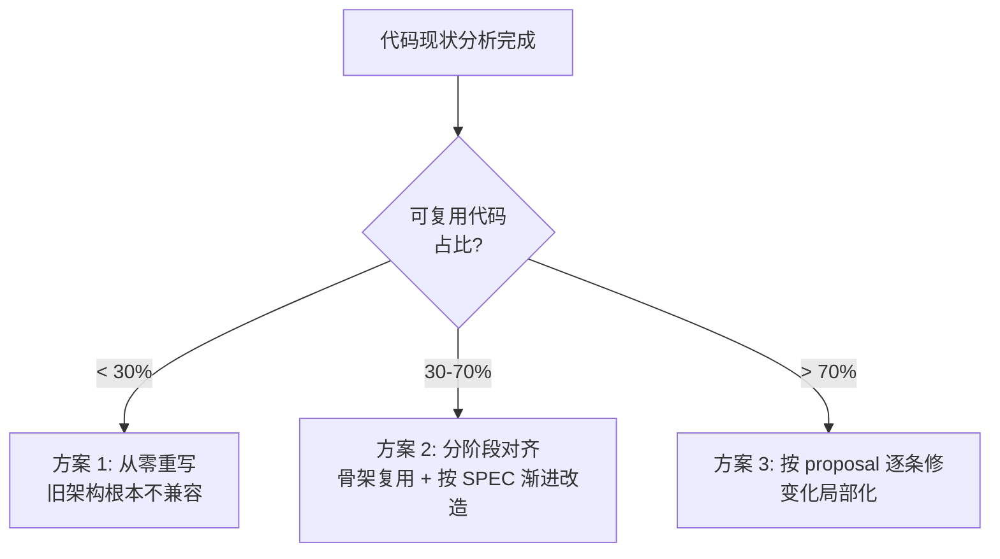
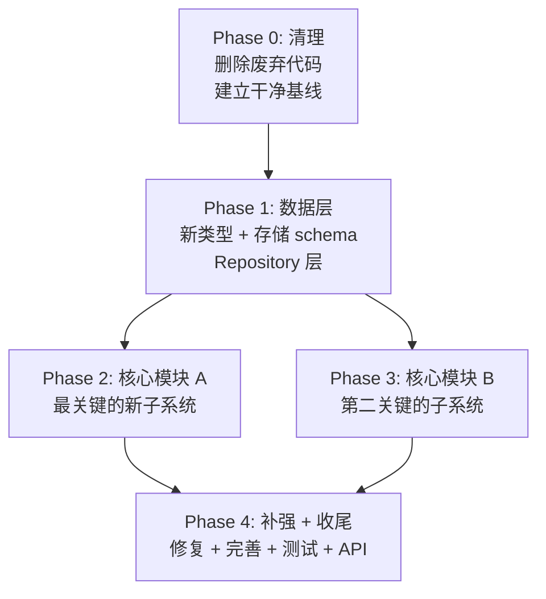

# Large-Scale Refactoring Planner

## Purpose

Guide the planning of multi-phase refactoring projects where a codebase needs to evolve from one architectural version to another. This skill encodes the decision framework, analysis methodology, phasing strategy, and plan document format.

This skill produces the **plan document** only. For executing individual proposal items within a plan, use the `implement-proposals` skill. For writing or rewriting PRD/SPEC documents that feed into a plan, use the `prd-spec-authoring` skill.

## When to Use

- Codebase needs architectural refactoring guided by PRD/SPEC documents
- Feature proposals need to be consolidated into a phased implementation roadmap
- Major version migration (V0→V1, V1→V2) needs a phased implementation plan
- User asks "how should we implement these changes" for a large set of proposals
- Multiple interdependent feature proposals need unified ordering and staging

## Reference Files

- [Plan template](./references/plan-template.md) — Document structure and required sections
- [Strategy decision guide](./references/strategy-guide.md) — How to choose rewrite vs incremental

## Procedure

### Phase 1: Quantitative Code Analysis

Before any planning, gather hard data about the codebase. Do not plan based on assumptions.

1. **Measure every module**: Count lines per directory/layer using `find ... | xargs wc -l`. Record results.

2. **Classify each module's change degree**: For every module, assess against target architecture (PRD/SPEC/proposals):

   | Symbol | Degree | Meaning |
   |--------|--------|---------|
   | ❌ | Delete | Entire module removed |
   | 🔴 | Large | Core logic rewritten or replaced |
   | 🟡 | Medium | Extensions + fixes, skeleton preserved |
   | 🟢 | Small | Minor adjustments |
   | ✅ | None | Fully reusable as-is |

3. **Assess reuse value**: For each module, judge whether existing code provides reusable **infrastructure** (DB connections, ORM patterns, API frameworks, protocol adapters, config loaders) even if business logic changes. Infrastructure skeleton is often worth keeping even when logic is 🔴.

4. **Build the decision matrix**: Output consolidated table for user review:

   ```markdown
   | Module | Lines | Change Degree | Reuse Value | Notes |
   |--------|-------|--------------|-------------|-------|
   | core/types | 789 | 🔴 大改 | ⚠️ 低 | 骨架保留但需大幅扩展 |
   | adapters/acp | 1402 | 🟡 中改 | ✅ 高 | ACP 核心逻辑可复用 |
   ```

### Phase 2: Strategy Decision

Present the analysis to the user and recommend a strategy.



| Strategy | When to choose | Risk profile |
|---|---|---|
| **Clean rewrite** | Reusable < 30%; old arch fundamentally incompatible | High: lose proven plumbing |
| **Phased SPEC alignment** | 30-70% reusable; new arch extends old skeleton | Medium: needs careful staging |
| **Per-proposal fixes** | > 70% reusable; changes are localized | Low: may miss cross-cutting |

**Decision principle**: Old code's value is in **infrastructure skeleton**, not business logic correctness. If skeleton is reusable, prefer phased alignment.

See [strategy-guide.md](./references/strategy-guide.md) for detailed trade-off analysis.

### Phase 3: Phasing Design

Design implementation phases following these mandatory rules:

**Rule 1 — Compilable checkpoints**: Each phase ends in a compilable, testable state. No phase leaves the codebase broken.

**Rule 2 — Dependency ordering**: Phases must follow this canonical structure:



Concrete phase count may vary (3-6 phases is typical). But ordering must respect:
- Clean before build
- Types + storage before business logic
- Core new modules before integration/polish
- Risk-heavy phases early, polish phases last

**Rule 3 — Phase granularity**: Each phase should have 5-15 concrete task items. Fewer = too vague; more = should be split.

**Rule 4 — SPEC traceability**: Every phase header must reference the SPEC sections it implements.

### Phase 4: Write the Plan Document

Produce `PLAN.v{N}.md` at the repository root, following [plan-template.md](./references/plan-template.md).

**Per-phase required content**:

| Section | Content |
|---|---|
| Phase header block | Goal, effort estimate, SPEC references, dependencies |
| Task table | File path, operation (new/modify/delete), specific description |
| Key implementation notes | For complex tasks: methods, interfaces, fields, algorithms |
| Acceptance criteria | `- [ ]` checklist, each item testable and specific |

**Document-level required content**:

| Section | Content |
|---|---|
| Overall strategy | Strategy summary + code volume estimate |
| Phase dependency diagram | Mermaid flowchart |
| File change manifest | All new/deleted/modified files with phase number |
| Quality assurance | Test strategy per type (unit/integration/smoke/regression) |
| Risks & mitigations | Known risks with specific countermeasures |

### Phase 5: Validate and Present

Before presenting to user:

- [ ] Every proposal item (FP-xx, P0-xx, P1-xx) is covered by at least one phase
- [ ] Every SPEC section has corresponding tasks
- [ ] No circular phase dependencies
- [ ] Each acceptance criterion is testable (`npm test passes`, not `should work`)
- [ ] File change manifest is complete and consistent with task lists
- [ ] Line count estimates are plausible

Present with a summary table showing phase / content / effort / file counts. Ask user to confirm strategy before implementation begins.

## Anti-Patterns

| Anti-pattern | Problem | Correct approach |
|---|---|---|
| Big-bang phase | One huge phase does everything | ≤15 tasks per phase; split if more |
| Types and logic mixed | New types and business logic in same phase | Types + storage first, then logic |
| No cleanup phase | Dead code lingers, confuses diffs | Phase 0 always cleans first |
| ASCII art diagrams | Render poorly in many tools | Use mermaid |
| Vague acceptance criteria | "Should work correctly" | Specific: "`npm test` passes", "Tool X rejected when not in bundle" |
| Missing file manifest | Hard to track scope | Always list new/delete/modify with phase |
| Assumed parallelism | Phases assumed parallel without proof | Default serial; annotate parallel only when safe |
| Effort-free estimates | No line counts or time signals | Always include estimated lines changed |
